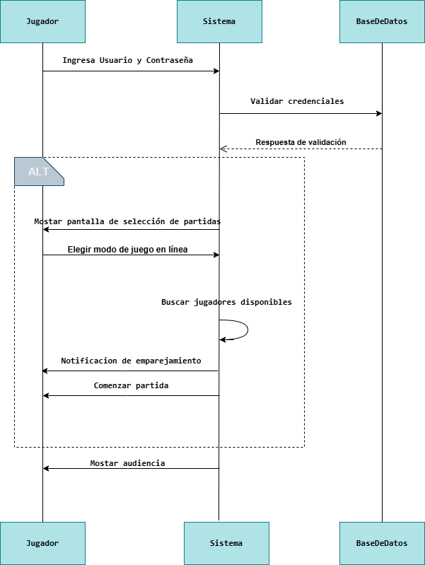

# Sistema-de-Videojuegos-en-Linea

## Diagrama de secuencia que represente el siguiente flujo de interacción entre un jugador y el sistema:

1- El jugador ingresa su nombre de usuario y contraseña.

2- El sistema valida las credenciales con la base de datos.

3- Si las credenciales son correctas, el sistema muestra la pantalla de selección de partidas.

4- El jugador elige una opción de juego en línea.

5- El sistema busca jugadores disponibles y los empareja.

6- Cuando se encuentra un grupo adecuado, el sistema notifica al jugador y comienza la partida.

    nota: 
    Cuando hay suficientes jugadores, el sistema avisa al jugador y la partida empieza.
En resumen: El jugador inicia sesión, el sistema verifica los datos, luego el jugador elige un juego, el sistema busca otros jugadores y, cuando todo está listo, comienza la partida.

## author: habccode;